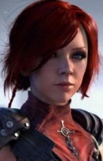

<html>

<b>Chloe NPC</b>

<b>NPC mod for BG2EE and EET</b>

Chloe is a female kensai NPC. She is romanceable by human, elven, and half-elven females (although Imoen must be in the party for the romance to succeed). If the PC is male or not interested in a romance or Chloe is not interested in a romance with the PC and Imoen is in the party, she will romance Imoen. Yes, as you may be pleased or shocked to hear, Chloe is a lesbian romance mod!

Chloe is found in the Air Pocket-Plane in Irenicus' Dungeon (and is not compatible with Dungeon-Be-Gone). She has a big added quest, special abilities, flirts and lovetalks. She banters with every Bioware NPC at least twice. Chloe does not push herself onto you, in absence of rejection. Chloe will only romance a PC that interests her, and the dialogue choice to increase her interest might not always be apparent. She is not guaranteed to remain with the player at the Tree of Life, and may decide that her life is more important than yours!
 
Extended version 
- Revised personal items usable only by Chloe
- New portrait for Chloe
- Journal adaptation for EE
- Kit adapted to EE
- Personal weapons repaired, - minor bug fixes + removal of unused code, - Imoen banters fixed for EET

- additional SoA banters
- Chloe works for Lathander against the beholder cult and may gain the temple stronghold on behalf of the party (if Player does not qualify in the first place)

- Chloe slaver encounter triggers for all players (additional test for tree of life)
- Chloe stays in male party at tree of life if Imoen or Sandrah is with you

ToB contents 
- Chloe cannot be summoned into ToB by fate spirit but has higher chance to stay at SoA end
- several ToB banters (to be expanded)

- Chloe confronts Illasera (Chloe slaver quest final)
- Volo recognises Chloe
- Gorion wraith recognises Chloe
- Chloe finds her father and her final set of swords
- Reactions on Charname's decision at ToB final
 
&nbsp;

&nbsp;

</body>

</html>
